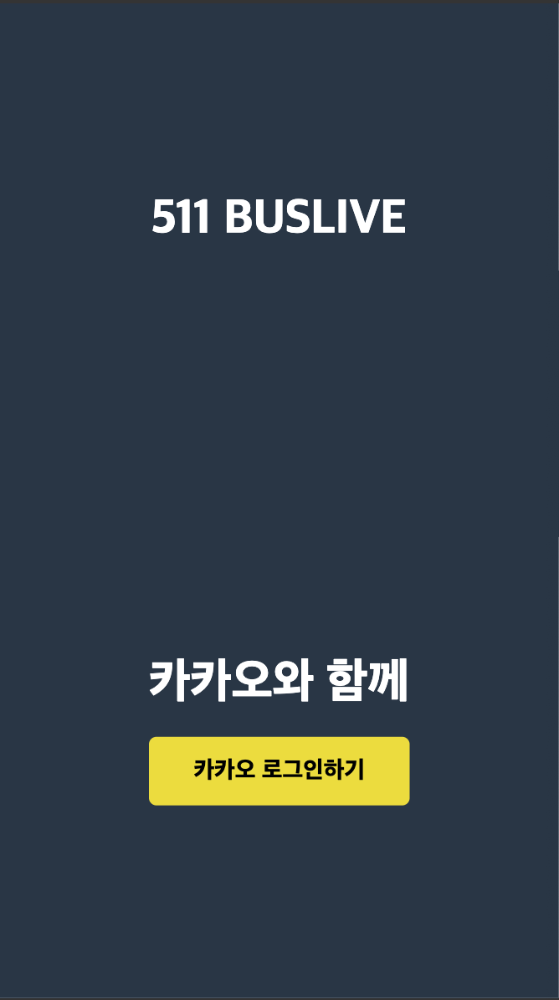
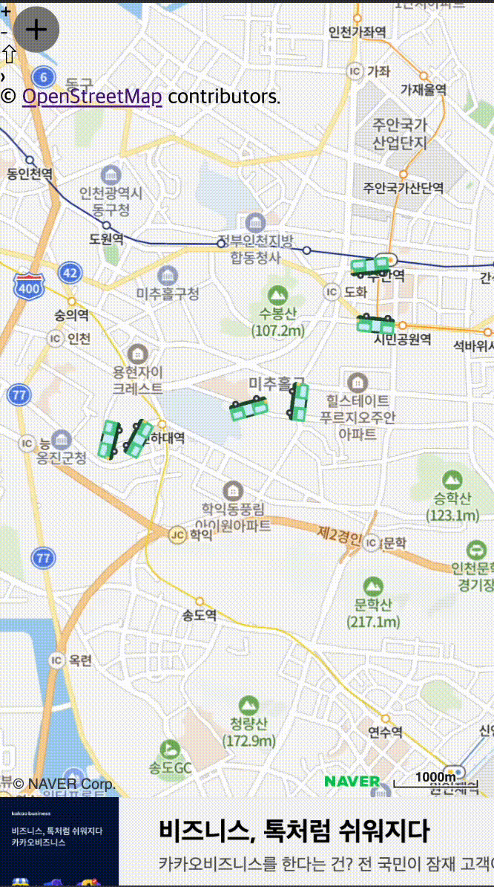
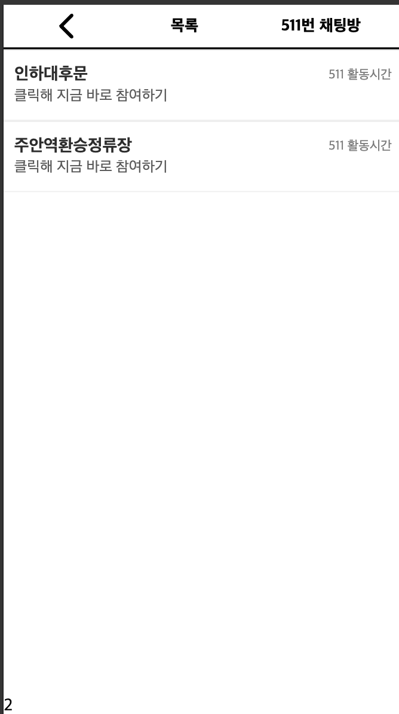
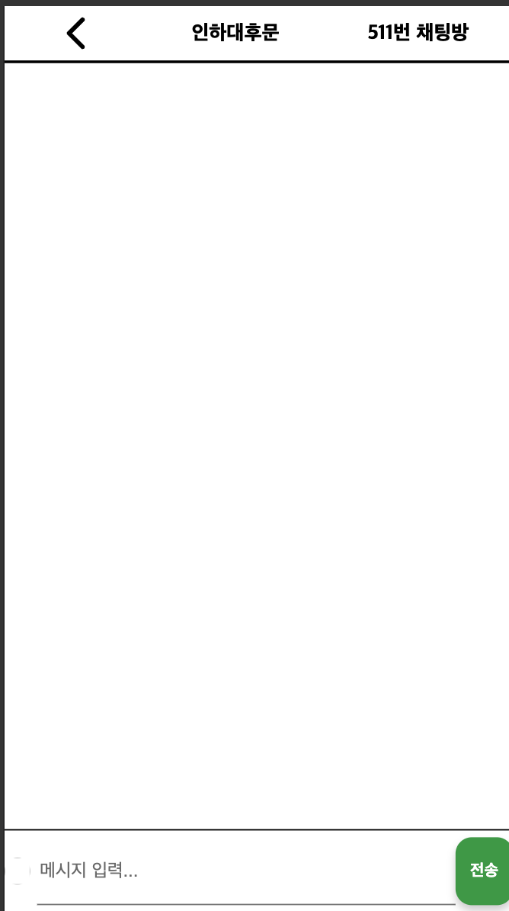
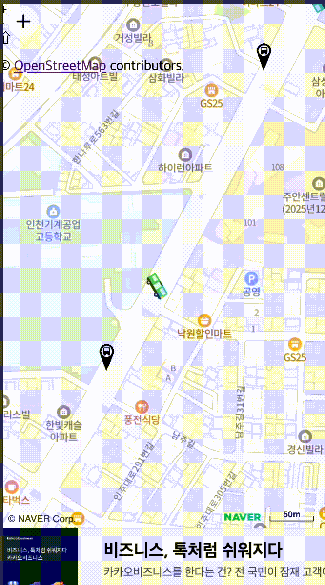

# 🚍 BusLive

**🏆 인컴해커톤 linced3.0 주관 대상 프로젝트**

---

## 📖 소개

**BusLive**는 인천 지역의 버스 이용자들을 위해 **정확한 도착 예측 및 실시간 위치 추적 서비스**를 제공합니다.  
이 프로젝트는 **인컴해커톤 linced3.0**에서 대상을 수상하며, 혁신적인 솔루션으로 인정받았습니다.  
카카오 버스의 초정밀 위치 추적이 인천 지역에서 지원되지 않는 문제를 해결하기 위해,  
**노드 좌표와 구간별 평균 속도**를 활용하여 실시간 버스 위치를 보다 정확하게 예측합니다.

---

## 🖼 스크린샷

<table class="screenshot-table" align="center">
  <tr>
    <td align="center">
      
      <br><b>Login Page</b>
    </td>
    <td align="center">
      
      <br><b>Main Page</b>
    </td>
    <td align="center">
      
      <br><b>Chat List</b>
    </td>
    <td align="center">
      
      <br><b>Chat Page</b>
    </td>
    <td align="center">
      
      <br><b>Move Feature</b>
    </td>
  </tr>
</table>
---

## ✨ 주요 기능

- 🚌 **실시간 버스 위치 추적**

  - 노드 기반 좌표 시스템 및 평균 속도를 활용한 위치 예측

- ⏳ **정확한 예상 도착 시간 제공**

  - 카카오 버스 수준의 예측 정확도 달성

- 📲 **모바일 웹 최적화 UI/UX**

  - 반응형 디자인으로 다양한 기기에서 최적의 경험 제공

- 💬 **정거장 내 실시간 채팅**
  - 정거장에서 사용자 간 커뮤니케이션 기능 제공

---

## 🛠 기술 스택

- **Frontend:** React, Recoil
- **Backend:** Node.js, Express
- **API:** 실시간 교통정보 API 연동
- **배포:** AWS (EC2)
- **기타:** WebSocket을 통한 실시간 데이터 반영

---

## 🏗 아키텍처

본 프로젝트는 **FSD(Feature-Sliced Design)** 아키텍처를 기반으로 설계되었습니다.  
이를 통해 프로젝트의 유지보수성과 확장성을 향상시켰습니다.

```
src/
├── App/
│   ├── index.js
├── entities/
│   ├── Bus/
│   └── Chat/
├── page/
│   ├── ChatListPage/
│   ├── ChatPage/
│   ├── LoginPage/
│   ├── Map/
│   ├── SplashPage/
│   └── index.js
├── shared/
│   └── recoil/
└── widget/
    ├── comment/
    └── comment_input/
```

---

## 👥 팀원

- 👤 **한만욱** - Frontend Developer / UI/UX Designer
- 👤 **김재걸** - Backend Developer

---

## 📝 라이선스

이 프로젝트는 [MIT License](LICENSE)로 제공됩니다.

---

## 🤝 기여 방법

기여를 환영합니다!

1. 이슈를 생성해 아이디어를 공유해주세요.
2. 프로젝트를 포크하고 브랜치를 생성하세요.
3. PR을 제출해 주세요.

---
